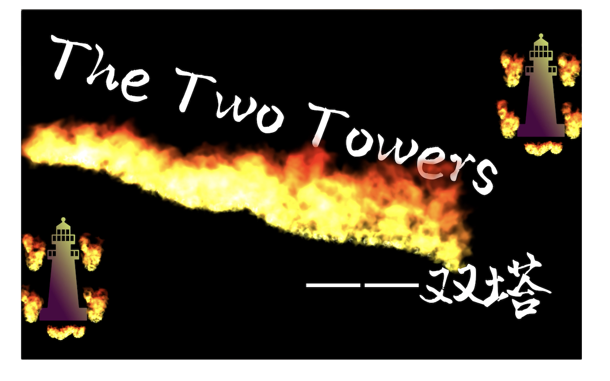

# ~~Involution~~ Two Towers

欢迎来到Two Towers项目的官方主页, 该项目由[@Chen-Yue-Zhao](https://github.com/Chen-Yue-Zhao), [@libinghui0000](https://github.com/libinghui0000), [@dongruihan](https://github.com/dongruihan), [@zinccat](https://github.com/zinccat)共同维护

其中,

gameClient.py 为带有使用EasyGui编写的欢迎界面的游戏客户端

gameClientNoGUI.py 与之类似, 但不含EasyGui界面, 可在前者无法使用时运行

gameServer.py 是运行在游戏服务器端的程序

config.py 中定义了游戏所使用的各种参数

backstage.py 为游戏后端(含EasyGui代码)

backstageNoGUI.py 也是游戏后端(但是不含EasyGui代码)

warrior.py 中定义了Warrior类

Roadpos_set.py 中计算出了了地图上各点的坐标

GameDesign.pdf 为一份较为具体的游戏设计方案

AlphaManipulation.py 用于更改图片透明度

CommandList.xlsx 中记录了游戏指令的对应关系, 便于开发者查询

fonts, images, music 文件夹中分别包含了游戏所使用的字体, 图片, 和音乐

Enjoy~